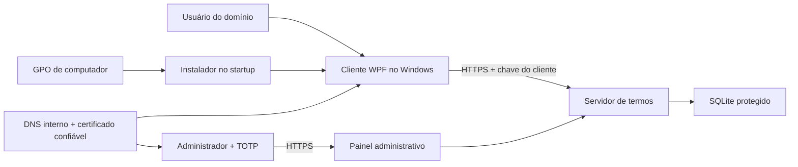

# Arquitetura

## Componentes



## Cliente Windows

- Executado por tarefa agendada no logon.
- Obtém SID, nome do computador, UUID, serial, fabricante e modelo.
- Consulta o status do aceite.
- Mostra a interface em tela cheia quando existe pendência.
- Bloqueia o fechamento normal e cobre monitores secundários.
- Mantém progresso de leitura acumulado.
- Envia o aceite somente após todas as validações.
- Registra diagnóstico em log local.

## Servidor

- Serviço HTTPS interno.
- Mantém versões do termo, dispositivos, aceites e auditoria.
- Valida novamente o CPF e o hash do termo.
- Usa a hora do servidor para a evidência.
- Gera protocolo, PDF e CSV.
- Oferece painel administrativo protegido por senha e TOTP.

## Identidade do aceite

```text
term_id + device_id + user_sid
```

Essa chave impede duplicidade para a mesma versão, máquina e usuário.

## Evidência

O hash da evidência combina informações relevantes, incluindo:

- hash do texto publicado;
- UUID e identificação do equipamento;
- usuário e SID;
- hash protegido do CPF;
- data e hora do servidor.

O valor resultante é registrado com SHA-256 e associado a um protocolo.

## Rede

- O cliente utiliza somente HTTPS.
- O DNS interno aponta `<URL-TERMOS>` para `<SERVIDOR-TERMOS>`.
- O certificado deve corresponder ao nome DNS e estar confiável nos computadores.
- Portas de compatibilidade devem ser mantidas apenas durante migrações controladas.
- Obras remotas dependem da conectividade corporativa, por exemplo VPN site-to-site.

